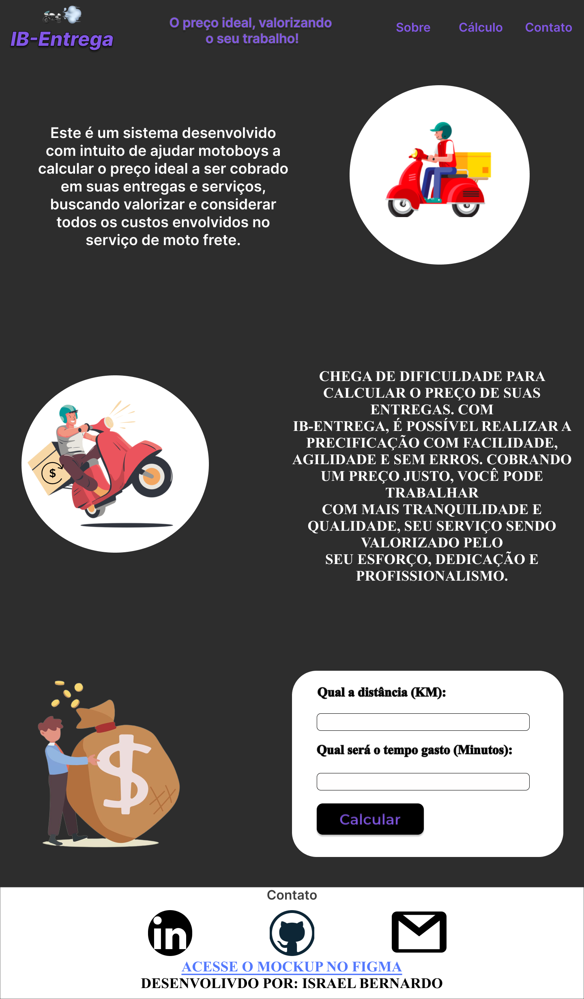

<h1 align="center"> IB-Entrega </h1>

  

## 🚀 Tecnologias

Esse projeto foi desenvolvido com as seguintes tecnologias:

- React.js
- Postgree
- Git e Github
- Figma

## 💻 Projeto

O IB-Entrega é um app para ajudar motoboys a precificar suas entregas.

- [Visite o projeto online](https://ibentrega.vercel.app/)

## 🔖 Layout

Você pode visualizar o layout do projeto através [DESSE LINK](https://www.figma.com/file/yMaiJ77xovWkOGuvyCb0JN/Untitled?type=design&node-id=0-1&mode=design&t=8aRDYsLkeXRxCozn-0). É necessário ter conta no [Figma](https://figma.com) para acessá-lo.

 Feito com ♥ by Israel Bernardo